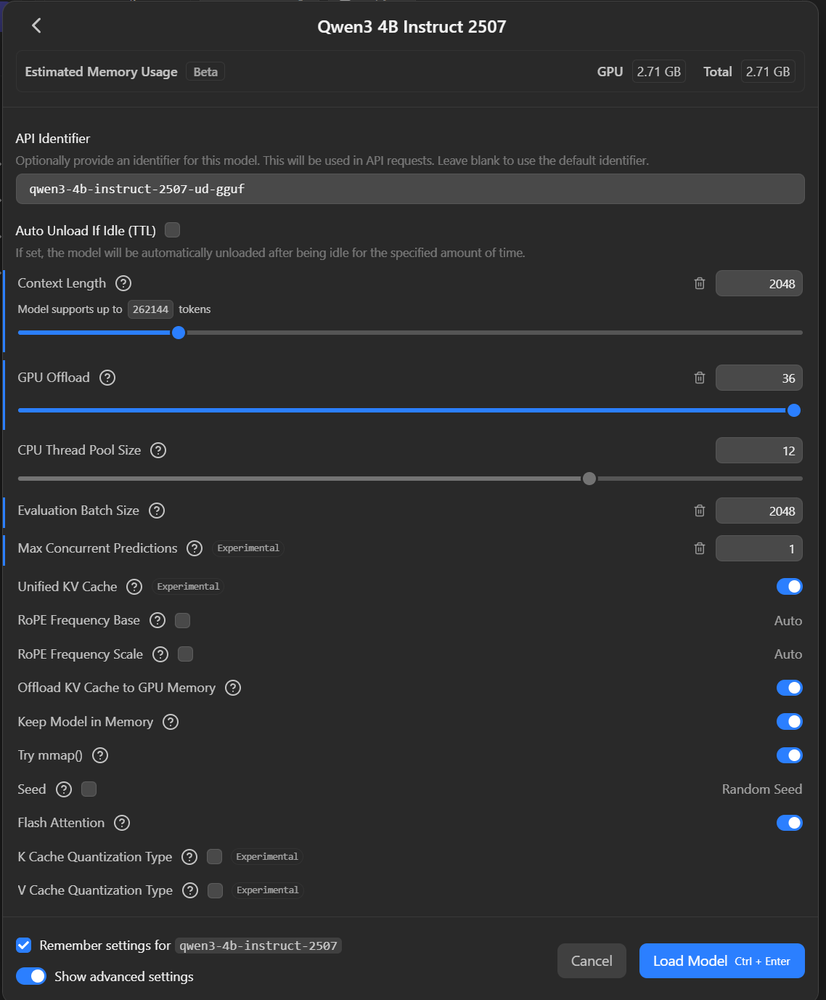

<p align="center">
  
</p>

# Murmur

A fully local voice engine for Windows. Press a key, talk, it types. No cloud, no API keys, no subscription — just your GPU.

Real-time dictation into any window, audio file transcription, local LLM cleanup, DSP processing, and a C++ desktop UI. Everything runs on your machine.

---

<details>
<summary><strong>Table of Contents</strong></summary>

- [What Is This?](#what-is-this)
- [**Quick Start (Install)**](#quick-start)
- [How It Works](#how-it-works-quick-version)
- [What It Actually Does](#what-it-actually-does)
  - [Voice to Text](#-voice--text-whisper)
  - [Audio-to-Text File Transcription](#-audio-to-text-file-transcription)
  - [WAV Recording](#-wav-recording)
  - [Cleanup Modes](#-cleanup-modes-optional)
  - [Real-Time DSP](#-real-time-dsp)
  - [Desktop UI](#-c-desktop-ui)
  - [Profiles + Auto-Detect](#-profiles--auto-detect)
  - [Voice Commands](#-voice-commands)
  - [Approval Mode](#-approval-mode)
  - [Push-to-Talk](#-push-to-talk)
- [The Stack](#the-stack)
- [Configuration](#configuration)
- [Building from Source](#building-from-source)
- [HTTP API](#http-api)
- [Architecture](#architecture)
- [License](#license)

</details>

---

## What Is This?

Murmur is a local voice engine that does two things:

1. **Real-time dictation** — press a key, talk, it types directly into whatever window you have focused.
2. **Audio file transcription** — drop in a WAV, MP3, FLAC, or M4A. Get clean text back. Save as plain text or formatted markdown.

It runs:

- **Whisper** on your GPU (via [faster-whisper](https://github.com/SYSTRAN/faster-whisper)) — ships with `distil-large-v3.5`, switchable to `large-v3` and others
- **Optional local LLM cleanup** via [LM Studio](https://lmstudio.ai) or native [llama.cpp](https://github.com/ggerganov/llama.cpp) — recommended model: [Qwen3-4B Instruct](https://huggingface.co/unsloth/Qwen3-4B-Instruct-GGUF)
- **A real-time DSP chain** (noise gate + compressor)
- **A C++ desktop UI** (Dear ImGui + DirectX 11)

For live dictation, it types the result straight into your active window using `SendInput`. Direct keystroke injection, no clipboard.

For file transcription, it runs Whisper over your audio file with progress tracking, optionally cleans it up through your local LLM, and saves the result to disk.

---

## Quick Start

> [!IMPORTANT]
> **Requirements:**
> - Windows 10 or 11
> - NVIDIA GPU with CUDA support (4GB+ VRAM) recommended — without one, transcription falls back to CPU (works, but noticeably slower)
> - For cleanup modes (Clean/Prompt/Dev/Detailed): [LM Studio](https://lmstudio.ai) running at `localhost:1234` with a model loaded, or [llama.cpp](https://github.com/ggerganov/llama.cpp) server. Recommended model: **Qwen3-4B Instruct** (`qwen3-4b-instruct-2507-ud-gguf`). Raw mode works without any LLM.
> - Optional: [ffmpeg](https://ffmpeg.org/) on PATH (only needed for MP3 export from WAV recordings)

> [!NOTE]
> **Windows only.** Murmur uses Windows-native APIs throughout — SendInput for text injection, DirectX 11 for the UI, WASAPI for audio capture, and Win32 for hotkey suppression and window detection.

<details>
<summary><strong>Recommended LM Studio Settings for Qwen3-4B</strong></summary>

<br>

<p align="center">
  
</p>

These settings are tuned for dictation workloads — short inputs, fast responses, minimal resource usage:

| Setting | Value | Why |
|---------|-------|-----|
| **Context Length** | 2048 | Dictation chunks are short — halves KV cache memory vs default |
| **GPU Offload** | Max (36 layers) | Model is 2.71 GB; RTX 4090 has 24 GB — all layers on GPU |
| **Eval Batch Size** | 2048 | Full prompt prefilled in one pass — faster time-to-first-token |
| **Max Concurrent Predictions** | 1 | Single user — frees KV cache, removes scheduling overhead |
| **Flash Attention** | ON | Faster attention computation |
| **Keep Model in Memory** | ON | No reload delay between requests |

</details>

### Option 1: Pre-Built (Recommended)

> [!TIP]
> **No Python, no dependencies, no build steps.** Just download and run.

1. Download the latest release from [**Releases**](https://github.com/Roach9223/Murmur/releases)
2. Extract the zip **to a user-writable location** (e.g. `C:\Users\you\Murmur` or another drive — *not* `Program Files`; Murmur stores its models, config, and logs next to the exe)
3. Run **`Murmur.exe`**
4. Press **F1** (or click the banner). Talk. Pause. It types.

The UI launches the Python engine automatically in the background. The first run downloads the Whisper model (~1.5GB) into the `models/` folder, which may take a few minutes — the banner shows "loading" until it's ready.

> [!NOTE]
> **Windows SmartScreen**: the release is not code-signed, so the first launch shows "Windows protected your PC." Click **More info → Run anyway**. Some antivirus tools may also flag the keyboard hook Murmur uses to type for you — that's the app's core feature, not malware; add an exclusion if needed.
>
> **No NVIDIA GPU?** (AMD/Intel GPU or none) Murmur detects this at startup and automatically runs a CPU-sized Whisper model (`small.en`) — near-real-time dictation on a modern CPU. You can pick a different model anytime from the **Model** dropdown in the UI. AMD/Intel GPUs can't accelerate inference yet (the engine is CUDA-only); a Vulkan backend for non-NVIDIA GPUs is planned.

### Option 2: From Source

> [!NOTE]
> Requires **Python 3.11+** and an NVIDIA GPU with **CUDA toolkit** installed.

```bash
git clone https://github.com/Roach9223/Murmur.git
cd Murmur

python -m venv venv
venv\Scripts\activate
pip install -r requirements.txt  # includes CUDA PyTorch index
```

Then run the engine:

```bash
# With the desktop UI (starts HTTP API for Murmur.exe to connect):
python app.py --server

# Headless mode (tray icon + hotkey only, no UI):
python app.py

# Force Raw mode (skip LLM cleanup, useful if LM Studio isn't running):
python app.py --no-cleanup
```

### CLI Flags

| Flag | Default | What it does |
|------|---------|-------------|
| `--server` | off | Start HTTP API on `127.0.0.1:8899` (required for Murmur.exe UI) |
| `--port N` | 8899 | Custom API port |
| `--no-cleanup` | off | Force Raw mode (no LLM) |
| `--base-dir PATH` | script dir | Override base directory for config/prompts/models/logs |

---

## How It Works (Quick Version)

Press F1. Talk. It types.

Five modes control how your speech gets processed:

| Mode | What You Get |
|------|-------------|
| **Raw** | Exactly what Whisper hears, no cleanup. The default — works out of the box, no LLM needed. |
| **Clean** | Filler words removed, punctuation added. Your exact words preserved. Requires a local LLM. |
| **Prompt** | Your rambling restructured into clear LLM prompts |
| **Dev** | Speech converted into numbered tasks and checklists |
| **Detailed** | Speech expanded into clear, well-structured paragraphs |

Profiles auto-switch modes based on your active window:

- Open **VS Code** → Dev mode
- Open **Terminal** → Raw mode (commands need exact text)
- Open **LM Studio** → Prompt mode
- Everything else → Raw mode (switch the Default profile to Clean if you run a local LLM)

You can also switch manually via the UI or tray menu. Customize profiles and auto-detect rules in `config.json`.

---

## What It Actually Does

<p align="center">
  
  <br>
  <em>The Murmur desktop UI. DSP controls, spectrum analyzer, latency breakdown, engine status.</em>
</p>

### Voice → Text (Whisper)

Runs locally on your GPU using [faster-whisper](https://github.com/SYSTRAN/faster-whisper). CUDA, float16, anti-repetition params. No NVIDIA GPU? It falls back to CPU (int8) automatically.

You speak normally. It segments on silence (configurable energy threshold + timeout). Transcribes under 500ms per chunk on an RTX 4090.

Optional **Silero VAD** (neural speech detection) is available when running from source with torch installed — enable it via `config.json`. The pre-built release uses energy-threshold detection to keep the download small.

<details>
<summary><strong>Whisper Model Comparison</strong></summary>

<br>

Murmur picks a model for your hardware automatically: NVIDIA GPU → `Purfview/faster-distil-whisper-large-v3.5` (near-large-v3 accuracy at a fraction of the latency and VRAM); no CUDA → `small.en` (fast on CPU). Switch anytime from the **Model** dropdown in the UI — your choice is remembered. A **GPU/CPU badge** next to the dropdown shows which hardware is actually doing the work.

| | large-v3 | large-v3-turbo |
|---|---|---|
| **Parameters** | 1.55B | 809M |
| **Decoder layers** | 32 | 4 |
| **Speed (RTX 4090)** | ~1000ms / 15s chunk | ~400-600ms / 15s chunk |
| **Accuracy** | Best | Slightly lower on accented/noisy speech |
| **VRAM** | ~3 GB | ~1.5 GB |

Both are supported by faster-whisper out of the box. The turbo variant is a good option if you need lower latency or have limited VRAM. For clean English speech, the accuracy difference is negligible (<1% WER).

</details>

### Audio-to-Text File Transcription

Got a meeting recording? A voice memo? Drop the file in, get clean text back.

- Supports **WAV, MP3, FLAC, M4A**
- **Progress tracking** in real time
- **Optional LLM cleanup** — same local model that cleans your dictation
- **Save as plain text or formatted markdown**
- Output in `Transcriptions/` with timestamped filenames

### WAV Recording

Capture mic audio for debugging, archival, or later transcription.

- Record at any time, **pre-DSP** (raw mic) or **post-DSP** (after processing)
- Non-blocking — doesn't slow down dictation
- Files saved to `Recordings/` with timestamped filenames
- **MP3 export** via ffmpeg (if installed)

### Cleanup Modes (Optional)

Five modes, each with its own system prompt, temperature, and token limit:

| Mode | LLM | What it does |
|------|-----|-------------|
| **Raw** | OFF | Exactly what Whisper hears. No processing. Default. |
| **Clean** | ON | Removes filler words, adds punctuation. Keeps your exact words. |
| **Prompt** | ON | Turns speech into structured, LLM-ready prompts. |
| **Dev** | ON | Turns rambling into numbered tasks and checklists. |
| **Detailed** | ON | Expands speech into detailed, well-structured paragraphs. |

Cleanup runs through a local LLM — either **LM Studio** (OpenAI-compatible API) or **native llama.cpp** server. Switch backends from the UI (Edit > LLM Backend) or `config.json`. If the LLM is down, falls back to raw text silently.

### Real-Time DSP

**Noise gate** with hysteresis, attack/release/hold, two-phase auto-calibration (silence + speech measurement), smooth attenuation to configurable floor. Vectorized, zero-alloc.

**Compressor** — feed-forward, RMS-based, gentle defaults. Disabled by default.

**Spectrum analyzer** — 64-bin log-spaced FFT (50Hz–12kHz), EMA smoothing, peak hold, phase-based coloring. Toggle pre/post-DSP.

### C++ Desktop UI

Dear ImGui + DirectX 11 desktop app. Python engine runs separately, they talk over HTTP on localhost.

- Clickable recording banner (or use the hotkey)
- One-click mode pills (Raw/Clean/Prompt/Dev/Detailed) + profile and mic dropdowns on the main surface
- "Heard / Typed" output panel front and center, with the approval workflow inline
- Live spectrum analyzer + VU meter
- Collapsible sections for noise gate/compressor (with guided auto-calibration), recording & file transcription, and latency diagnostics
- Approval mode, push-to-talk, hotkey and media-key capture

### Profiles + Auto-Detect

Auto-switch profiles based on the active window.

| Profile | Mode | Notes |
|---------|------|-------|
| **Default** | Raw | General use, no LLM required |
| **Terminal** | Raw | No LLM, shell commands need exact text |
| **LM Studio** | Prompt | "Send" triggers Ctrl+Enter |
| **VS Code** | Dev | Structured task output |
| **Meeting** | Clean | Note-taking during calls |

Auto-detect polls the foreground window title every 500ms with regex rules. Customize in `config.json`.

### Voice Commands

Say "command" followed by a phrase:

| You say | What happens |
|---------|-------------|
| "command new line" | Shift+Enter (new line without sending) |
| "command send" | Enter (Ctrl+Enter in LM Studio profile) |
| "command copy" | Ctrl+C |
| "command paste" | Ctrl+V |
| "command clear" | Select All + Delete |
| "command stop dictation" | Stops recording |

Without the prefix, phrases are typed as regular text. The prefix is configurable in `config.json`.

### Approval Mode

When enabled, text is held for review instead of being typed immediately. Approve, edit, or reject.

### Push-to-Talk

Hold the hotkey to record, release to stop. Alternative to toggle mode.

---

## The Stack

- **Python 3.11+**: engine, audio pipeline, Whisper, LLM client
- **faster-whisper**: Whisper distil-large-v3.5 on CUDA float16 (CPU int8 fallback)
- **Silero VAD**: optional neural speech detection (source installs with torch)
- **LLM backend abstraction**: LM Studio (OpenAI-compatible) or native llama.cpp
- **FastAPI + uvicorn**: HTTP API between engine and UI
- **sounddevice / PortAudio**: WASAPI audio capture at 48kHz
- **numpy / scipy**: DSP processing, resampling (48kHz to 16kHz)
- **Dear ImGui + DirectX 11**: C++ desktop UI
- **cpp-httplib**: HTTP client in the UI
- **keyboard**: SendInput-based keystroke injection (KEYEVENTF_UNICODE)
- **pystray**: system tray icon (when running from source)

---

## Configuration

Everything is in `config.json`. If it's missing, defaults are used. Old configs without newer sections are backfilled automatically.

Key settings:

```json
{
  "whisper_model": "Purfview/faster-distil-whisper-large-v3.5",
  "mic_device_index": 0,
  "hotkey": "f1",
  "energy_threshold": 0.01,
  "silence_timeout": 1.5,
  "llm_mode": "raw",
  "llm_backend": {
    "type": "lmstudio",
    "lmstudio": { "url": "http://localhost:1234/v1/chat/completions" },
    "llamacpp": { "url": "http://localhost:8080" }
  },
  "command_prefix": "command",
  "voice_commands": { "..." : "..." },
  "llm_modes": { "..." : "..." },
  "profiles": { "..." : "..." },
  "auto_detect": { "..." : "..." },
  "dsp": { "..." : "..." },
  "vad": { "enabled": false, "threshold": 0.5, "min_silence_ms": 300 },
  "recording": { "default_source": "post", "save_dir": "Recordings" }
}
```

DSP slider changes save automatically. LLM backend is switchable at runtime from the UI.

---

## Building from Source

`build.bat` builds everything and assembles the `Murmur/` distribution folder.

### Prerequisites

- **Python 3.11+** with venv
- **NVIDIA CUDA Toolkit 12.1+**
- **Visual Studio 2022+** (C++ Desktop Development workload)
- **CMake 3.21+**
- **vcpkg** with the `VCPKG_ROOT` environment variable set
- **PyInstaller** (`pip install pyinstaller`)

### Full Build

```bash
python -m venv venv
venv\Scripts\activate
pip install -r requirements.txt
pip install pyinstaller

build.bat                  # Full build
build.bat --ui-only        # Rebuild C++ UI only (skips PyInstaller)
build.bat --release        # Also package a clean, scrubbed Murmur-release.zip for GitHub
```

> [!NOTE]
> `build.bat` uses a temp directory for intermediate build files (`F:\tmp` if it exists, else `%TEMP%`) and reads `%VCPKG_ROOT%` for the vcpkg toolchain.

---

## HTTP API

The engine exposes a REST API on `127.0.0.1:8899` (when run with `--server`). 30+ endpoints for full external control. CORS enabled.

**Core controls:** toggle/start/stop recording, set mode, set profile, voice commands.

**File transcription:** transcribe audio files with progress, save as txt or markdown.

| Method | Path | Purpose |
|--------|------|---------|
| POST | `/transcribe/file` | `{"path": "/path/to/audio.wav"}` — start transcription |
| POST | `/transcribe/save` | `{"format": "txt"}` or `{"format": "md"}` — save result |

**WAV recording:** record mic audio, export to MP3.

| Method | Path | Purpose |
|--------|------|---------|
| POST | `/record/start` | `{"source": "post"}` or `{"source": "pre"}` — start recording |
| POST | `/record/stop` | Stop and return `{path, seconds, dropped_frames}` |
| POST | `/record/export_mp3` | Convert WAV to MP3 via ffmpeg |

**DSP calibration:** two-phase auto-calibration.

| Method | Path | Purpose |
|--------|------|---------|
| POST | `/dsp/calibrate` | `{"action": "start"}` / `{"action": "finish_silence"}` / `{"action": "start_speech"}` / `{"action": "finish"}` |
| GET | `/calibrate/prompt` | Get a sentence for speech calibration |

**Plus:** approval workflow, feature toggles (push-to-talk, hotkey, mic), LLM backend switching, config read/write, log tailing, shutdown.

See [CLAUDE.md](CLAUDE.md) for the complete endpoint reference.

---

## Architecture

```
Python Engine (audio, DSP, Whisper, LLM, text injection)
        ↕  HTTP on 127.0.0.1:8899
C++ UI (ImGui + DX11, controls, spectrum, status)
```

14 independent Python services in `services/`. Each handles one thing. The orchestrator (`app.py`) wires them together.

Dual LLM backend support: LM Studio (OpenAI-compatible `/v1/chat/completions`) or native llama.cpp (`/completion`). Switchable at runtime via UI, tray, or API.

8-phase state machine: IDLE → LISTENING → RECORDING → TRANSCRIBING → CLEANING → TYPING (or PENDING_APPROVAL) → back to LISTENING. Any failure → ERROR (logged, loop continues).

See [CLAUDE.md](CLAUDE.md) for the deep technical docs.

---

## License

MIT License. See [LICENSE](LICENSE) for details.
