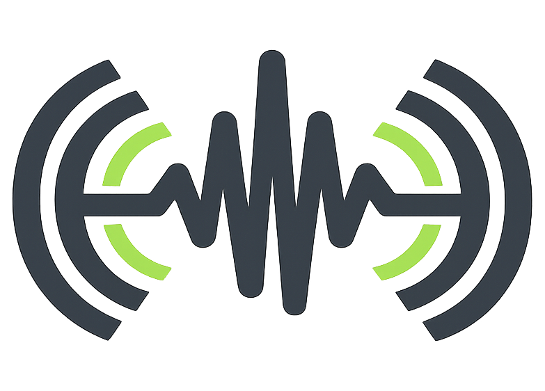
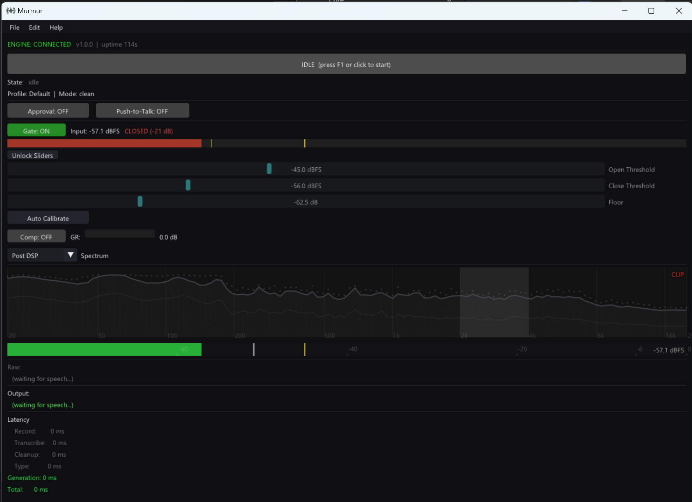

<p align="center">
  
</p>

# Murmur

So... I broke my wrist.

Typing sucked.

So I built this.

What started as a "quick little Python script" to dictate into whatever window I had open somehow turned into a hybrid C++ / Python voice engine with Whisper, a local LLM, a DSP chain, a real-time spectrum analyzer, profiles, auto-detect, an HTTP API... you know... normal casual overengineering.

Anyway.

Now it's open source.

If you want to talk instead of type, this is for you.

---

<details>
<summary><strong>Table of Contents</strong></summary>

- [What Is This?](#what-is-this)
- [**Quick Start (Install)**](#quick-start)
- [How It Works](#how-it-works-quick-version)
- [Why I Made This](#why-i-made-this)
- [What It Actually Does](#what-it-actually-does)
  - [Voice to Text](#-voice--text-whisper-large-v3)
  - [Audio-to-Text File Transcription](#-audio-to-text-file-transcription)
  - [WAV Recording](#-wav-recording)
  - [Cleanup Modes](#-cleanup-modes-optional)
  - [Real-Time DSP](#-real-time-dsp-because-noise-is-annoying)
  - [Desktop UI](#-c-desktop-ui)
  - [Profiles + Auto-Detect](#-profiles--auto-detect)
  - [Voice Commands](#-voice-commands)
  - [Approval Mode](#-approval-mode)
  - [Push-to-Talk](#-push-to-talk)
- [What This Is NOT](#what-this-is-not)
- [Who This Is For](#who-this-is-for)
- [The Stack](#the-stack-because-youll-ask)
- [Configuration](#configuration)
- [Building from Source](#building-from-source)
- [HTTP API](#http-api)
- [Architecture](#architecture)
- [License](#license)

</details>

---

## What Is This?

Murmur is a local voice engine that does two things:

1. **Real-time dictation** — press a key, talk, it types directly into whatever window you have focused.
2. **Audio file transcription** — drop in a WAV, MP3, FLAC, or M4A. Get clean text back. Save as plain text or formatted markdown.

No cloud. No API keys. No sending your voice to some mystery server. No subscription.

Services like REV charge $1.50/min for human transcription. Otter.ai and others charge monthly fees for AI transcription. Murmur does it locally, for free, with your own GPU and your own LLM. You own the entire pipeline.

It runs:

- **Whisper large-v3** on your GPU (via [faster-whisper](https://github.com/SYSTRAN/faster-whisper))
- **Silero VAD** for neural speech detection
- **Optional local LLM cleanup** (via [LM Studio](https://lmstudio.ai))
- **A real-time DSP chain** (noise gate + compressor)
- **A C++ desktop UI** (Dear ImGui + DirectX 11)

For live dictation, it types the result straight into your active window using `SendInput`. Direct keystroke injection, no clipboard nonsense.

For file transcription, it runs Whisper over your audio file with progress tracking, optionally cleans it up through your local LLM, and saves the result to disk.

You press a key. You talk. It types.

Or you hand it a file. It transcribes. You save.

That's it.

---

## Quick Start

> [!IMPORTANT]
> **Requirements:**
> - Windows 10 or 11
> - NVIDIA GPU with CUDA support (4GB+ VRAM)
> - For cleanup modes (Clean/Prompt/Dev): [LM Studio](https://lmstudio.ai) running at `localhost:1234` with a model loaded. Raw mode works without it.
> - Optional: [ffmpeg](https://ffmpeg.org/) on PATH (only needed for MP3 export from WAV recordings)

> [!NOTE]
> **Windows only.** Murmur uses Windows-native APIs throughout — SendInput for text injection, DirectX 11 for the UI, WASAPI for audio capture, and Win32 for hotkey suppression and window detection. These aren't abstractions we can swap out; they're deliberate choices for reliability on this platform.

### Option 1: Pre-Built (Recommended)

> [!TIP]
> **No Python, no dependencies, no build steps.** Just download and run.

1. Download the latest release from [**Releases**](https://github.com/Roach9223/Murmur/releases)
2. Extract the zip
3. Run **`Murmur.exe`**
4. Press **F1** (or click the banner). Talk. Pause. It types.

The UI launches the Python engine automatically in the background. The first run downloads the Whisper model (~3GB) and the Silero VAD model, which may take a few minutes.

No account. No API key. No subscription. Everything runs on your machine.

### Option 2: From Source

> [!NOTE]
> Requires **Python 3.11+** and an NVIDIA GPU with **CUDA toolkit** installed.

```bash
git clone https://github.com/Roach9223/Murmur.git
cd Murmur

python -m venv venv
venv\Scripts\activate
pip install -r requirements.txt  # includes CUDA PyTorch index
```

Then run the engine:

```bash
# With the desktop UI (starts HTTP API for Murmur.exe to connect):
python app.py --server

# Headless mode (tray icon + hotkey only, no UI):
python app.py

# Force Raw mode (skip LLM cleanup, useful if LM Studio isn't running):
python app.py --no-cleanup
```

### CLI Flags

| Flag | Default | What it does |
|------|---------|-------------|
| `--server` | off | Start HTTP API on `127.0.0.1:8899` (required for Murmur.exe UI) |
| `--port N` | 8899 | Custom API port |
| `--no-cleanup` | off | Force Raw mode (no LLM) |
| `--base-dir PATH` | script dir | Override base directory for config/prompts/models/logs |

---

## How It Works (Quick Version)

Press F1. Talk. It types.

Four modes control how your speech gets processed:

| Mode | What You Get |
|------|-------------|
| **Raw** | Exactly what Whisper hears, no cleanup |
| **Clean** | Filler words removed, punctuation added. Your exact words preserved. The default. |
| **Prompt** | Your rambling restructured into clear LLM prompts |
| **Dev** | Speech converted into numbered tasks and checklists |

Profiles auto-switch modes based on your active window:

- Open **VS Code** → Dev mode
- Open **Terminal** → Raw mode (commands need exact text)
- Open **LM Studio** → Prompt mode
- Everything else → Clean mode

You can also switch manually via the UI or tray menu. Customize profiles and auto-detect rules in `config.json`.

---

## Why I Made This

I couldn't type comfortably.
I needed speech-to-text.
But normal dictation software either:

- sends everything to the cloud,
- or gives you raw messy transcription,
- or feels like it was designed in 2004.

So I built something for myself.

Originally it was just:

```python
while listening:
    transcribe()
    type_text()
```

Then I added cleanup.
Then modes.
Then profiles.
Then a UI.
Then DSP.
Then I accidentally built an engine.

Classic.

---

## What It Actually Does

<p align="center">
  
  <br>
  <em>The Murmur desktop UI. DSP controls, spectrum analyzer, latency breakdown, engine status.</em>
</p>

### 🎙 Voice → Text (Whisper large-v3)

Runs locally on your GPU using [faster-whisper](https://github.com/SYSTRAN/faster-whisper). CUDA, float16, anti-repetition params. The whole stack.

Speech detection uses **Silero VAD** (a neural network that knows the difference between you talking and your keyboard clacking). It's a major upgrade over simple volume thresholds — fewer false triggers, cleaner segmentation, and it handles background noise gracefully. Falls back to energy-threshold detection if VAD isn't available.

You speak normally.
It segments on silence (configurable threshold + timeout).
It transcribes fast (under 500ms per chunk on an RTX 4090).

No internet required.

### 📄 Audio-to-Text File Transcription

This is the REV killer.

Got a meeting recording? A voice memo? An interview? Drop the file in, get clean text back.

- Supports **WAV, MP3, FLAC, M4A** — anything faster-whisper can read
- **Progress tracking** — watch it work through your file in real time
- **Optional LLM cleanup** — same local model that cleans your dictation cleans your transcriptions
- **Save as plain text or formatted markdown** — your choice
- Output lands in `Transcriptions/` with a timestamped filename

REV charges $1.50/min for human transcription. Otter.ai charges $16.99/month. You already have a GPU. This costs you nothing.

The whole thing runs through the UI or the HTTP API (`POST /transcribe/file`, `POST /transcribe/save`).

### 🎬 WAV Recording

Sometimes you want to capture what your mic is hearing — for debugging, for keeping a record, or for transcribing later.

- Record mic audio to WAV files at any time
- Choose **pre-DSP** (raw mic) or **post-DSP** (after noise gate + compressor) as the source
- Non-blocking — recording doesn't slow down dictation
- Files saved to `Recordings/` with timestamped filenames
- **MP3 export** via ffmpeg (if installed)

Start and stop via the UI or API (`POST /record/start`, `POST /record/stop`).

### 🧠 Cleanup Modes (Optional)

Because raw dictation sounds like this:

> "uh yeah so basically I was thinking that maybe we could refactor like the auth thing"

And that's not how you want your messages or prompts to look.

Four modes, each with its own system prompt, temperature, and token limit:

| Mode | LLM | What it does |
|------|-----|-------------|
| **Raw** | OFF | Exactly what Whisper hears. No processing. |
| **Clean** | ON | Removes filler words, adds punctuation. Keeps your exact words. Default. |
| **Prompt** | ON | Turns speech into structured, LLM-ready prompts. |
| **Dev** | ON | Turns rambling into numbered tasks and checklists. |

Cleanup runs through a local LLM via [LM Studio](https://lmstudio.ai) at `localhost:1234`. If LM Studio is down, it falls back to raw text silently. No crash, no hang.

Switch modes whenever you want. UI, tray menu, or API.

### 🎚 Real-Time DSP (Because Noise Is Annoying)

There's a noise gate.
There's an optional compressor.
There's a spectrum analyzer.

Did this need to exist?

Probably not.

Did I build it anyway?

Yes.

**The noise gate:**
- Uses hysteresis (separate open/close thresholds so it doesn't chatter)
- Has attack / release / hold time constants
- **Two-phase auto-calibration**: stay silent for 2s (measures room noise), then speak for 3s (measures your voice level). It computes optimal thresholds automatically. The UI gives you a sentence to read during calibration — generated by your local LLM or picked from a fallback list.
- Doesn't hard-mute. It attenuates smoothly to a configurable floor (preserves room tone)
- Vectorized gain ramp, no Python loops in the audio path

**The compressor:**
- Feed-forward, RMS-based envelope
- Gentle defaults that don't smash your voice into oblivion
- Configurable ratio, threshold, makeup gain
- Disabled by default

**The spectrum analyzer:**
- 64-bin log-spaced FFT (50Hz–12kHz)
- EMA smoothing, peak hold, noise floor tracking
- Phase-based coloring that changes with engine state
- Toggle pre/post-DSP to see what the gate is doing

Because why not.

### 🖥 C++ Desktop UI

I didn't want a clunky Python GUI.
So I built a Dear ImGui + DirectX 11 desktop app.

The Python engine runs separately.
They talk over HTTP on localhost.

Why?

Because Python is great for ML.
C++ is great for UI.
And I didn't want to fight tkinter.

The UI gives you:
- Clickable recording banner (or use the hotkey)
- DSP sliders with live spectrum
- Mode/profile switching
- Mic selection + hotkey configuration
- Approval mode (review text before it's typed)
- Latency breakdown: Record, Transcribe, Cleanup, Type, plus Generation (processing-only) and Total
- Push-to-talk toggle

### 🎯 Profiles + Auto-Detect

Switch profiles automatically based on the active window.

Open VS Code? It switches to Dev mode.
Open Terminal? Raw mode.
Open LM Studio? Prompt mode.

It just adapts. Five profiles out of the box:

| Profile | Mode | Notes |
|---------|------|-------|
| **Default** | Clean | General use |
| **Terminal** | Raw | No LLM, shell commands need exact text |
| **LM Studio** | Prompt | "Send" triggers Ctrl+Enter |
| **VS Code** | Dev | Structured task output |
| **Meeting** | Clean | Note-taking during calls |

Auto-detect polls the foreground window title every 500ms with regex rules. Customize in `config.json`.

### 🗣 Voice Commands

Say "command" followed by a phrase:

| You say | What happens |
|---------|-------------|
| "command new line" | Presses Enter |
| "command send" | Presses Enter (Ctrl+Enter in LM Studio profile) |
| "command clear" | Select All + Delete |
| "command stop dictation" | Stops recording |

Without the prefix, phrases are typed as regular text. Saying "new line" by itself just types "new line." The prefix is configurable in `config.json`. Set `command_prefix` to `""` to disable it.

### ✅ Approval Mode

When enabled, text is held for review instead of being typed immediately. You can:
- **Approve** to type it as-is
- **Edit** to modify in a text box, then send
- **Reject** to discard and keep listening

### 🎤 Push-to-Talk

Hold the hotkey to record, release to stop. Alternative to the default toggle mode. Useful in noisy environments or for short commands.

---

## What This Is NOT

- Not a SaaS.
- Not monetized.
- Not harvesting your voice.
- Not polished corporate software.
- Not guaranteed to never break.

It's a tool I built for myself that turned into something useful.

---

## Who This Is For

- People with injuries who don't want to type.
- Developers who talk faster than they type.
- People who'd rather not pay $1.50/min for transcription.
- People who like local-first software.
- People who like overbuilt personal tools.
- People who don't trust cloud dictation.

---

## The Stack (Because You'll Ask)

- **Python 3.11+**: engine, audio pipeline, Whisper, LLM client
- **faster-whisper**: Whisper large-v3 on CUDA, float16
- **Silero VAD**: neural speech detection (via torch.hub)
- **LM Studio**: local LLM for cleanup (optional)
- **FastAPI + uvicorn**: HTTP API between engine and UI
- **sounddevice / PortAudio**: WASAPI audio capture at 48kHz
- **numpy / scipy**: DSP processing, resampling (48kHz to 16kHz)
- **Dear ImGui + DirectX 11**: C++ desktop UI
- **cpp-httplib**: HTTP client in the UI
- **keyboard**: SendInput-based keystroke injection (KEYEVENTF_UNICODE)
- **pystray**: system tray icon (when running from source)

Yes, it's a hybrid.
Yes, it's slightly ridiculous.
Yes, it works.

---

## Configuration

Everything is in `config.json`. If it's missing, defaults are used. Old configs without newer sections (DSP, auto-detect, profiles) are backfilled automatically.

See the [config.json](config.json) in this repo for the full example with all options.

Key settings:

```json
{
  "whisper_model": "large-v3",
  "mic_device_index": 63,
  "hotkey": "f1",
  "energy_threshold": 0.01,
  "silence_timeout": 1.5,
  "llm_mode": "clean",
  "command_prefix": "command",
  "voice_commands": { ... },
  "llm_modes": { ... },
  "profiles": { ... },
  "auto_detect": { ... },
  "dsp": { ... },
  "vad": { "enabled": false, "threshold": 0.5, "min_silence_ms": 300 },
  "recording": { "default_source": "post", "save_dir": "Recordings" }
}
```

DSP slider changes save automatically. Other config changes take effect on engine restart.

---

## Building from Source

`build.bat` builds everything and assembles the `Murmur/` distribution folder. A fresh clone has no `Murmur/` folder — the build creates it.

### Prerequisites

- **Python 3.11+** with venv
- **NVIDIA CUDA Toolkit 12.1+**
- **Visual Studio 2022+** (C++ Desktop Development workload)
- **CMake 3.21+**
- **vcpkg** with the `VCPKG_ROOT` environment variable set
- **PyInstaller** (`pip install pyinstaller`) — for bundling the Python engine

### Full Build

```bash
# Set up Python environment first
python -m venv venv
venv\Scripts\activate
pip install -r requirements.txt
pip install pyinstaller

# Run full build
build.bat

# Or rebuild just the C++ UI (skips PyInstaller):
build.bat --ui-only
```

> [!NOTE]
> `build.bat` uses `%TEMP%` for intermediate build files and reads `%VCPKG_ROOT%` for the vcpkg toolchain.
> The final output goes to `Murmur/` in the repo root.

### Building Components Individually

**Python engine only** (PyInstaller):

```bash
venv\Scripts\activate
pyinstaller murmur-engine.spec --noconfirm
```

**C++ UI only** (CMake + vcpkg):

```bash
cd dictation-ui
cmake --preset release
cmake --build build/release --config Release
```

---

## HTTP API

The engine exposes a REST API on `127.0.0.1:8899` (when run with `--server`). 30+ endpoints for full external control. CORS enabled.

**Core controls:** toggle/start/stop recording, set mode, set profile, voice commands.

**File transcription:** transcribe audio files with progress, save as txt or markdown.

| Method | Path | Purpose |
|--------|------|---------|
| POST | `/transcribe/file` | `{"path": "/path/to/audio.wav"}` — start transcription |
| POST | `/transcribe/save` | `{"format": "txt"}` or `{"format": "md"}` — save result |

**WAV recording:** record mic audio, export to MP3.

| Method | Path | Purpose |
|--------|------|---------|
| POST | `/record/start` | `{"source": "post"}` or `{"source": "pre"}` — start recording |
| POST | `/record/stop` | Stop and return `{path, seconds, dropped_frames}` |
| POST | `/record/export_mp3` | Convert WAV to MP3 via ffmpeg |

**DSP calibration:** two-phase auto-calibration.

| Method | Path | Purpose |
|--------|------|---------|
| POST | `/dsp/calibrate` | `{"action": "start"}` / `{"action": "finish_silence"}` / `{"action": "start_speech"}` / `{"action": "finish"}` |
| GET | `/calibrate/prompt` | Get a sentence for the user to read during speech calibration |

**Plus:** approval workflow, feature toggles (push-to-talk, hotkey, mic), config read/write, log tailing, shutdown.

See [CLAUDE.md](CLAUDE.md) for the complete endpoint reference.

---

## Architecture

```
Python Engine (audio, DSP, Whisper, LLM, text injection)
        ↕  HTTP on 127.0.0.1:8899
C++ UI (ImGui + DX11, controls, spectrum, status)
```

13 independent Python services in `services/`. Each handles one thing. They don't import each other. The orchestrator (`app.py`) wires them together. Audio, DSP, transcriber, commands, output, LLM, config, tray, window detect, engine state, server, WAV recording, and VAD.

8-phase state machine: IDLE → LISTENING → RECORDING → TRANSCRIBING → CLEANING → TYPING (or PENDING_APPROVAL) → back to LISTENING. Any failure → ERROR (logged, loop continues).

See [CLAUDE.md](CLAUDE.md) for the deep technical docs.

---

## Why It's Open Source

Because:

- I built it for me.
- It might help someone else.
- Local-first tools should exist.
- If I ever stop maintaining it, someone else can keep it alive.

If you improve it, awesome.
If you fork it, awesome.
If you rip parts out for your own project, awesome.

---

## A Quick Note on Overengineering

This project was supposed to take about an hour.

The plan was simple:

> "I'll just write a quick Python script so I can talk instead of type while my wrist heals."

Something like:

```python
listen()
transcribe()
type()
```

Done. Easy.

Except then I thought:

- "It should probably clean up filler words."
- "Actually a noise gate would help."
- "Okay but now I want a spectrum analyzer."
- "Maybe profiles would be nice."
- "What if it auto-detected the active window?"
- "You know what… it needs a real UI."

Fast forward several hours and somehow we now have:

- Engine phases
- Latency metrics
- A DSP chain
- An HTTP API
- Profiles
- Auto-detection
- A C++ desktop UI
- A system tray service
- A real-time spectrum analyzer
- Audio file transcription
- WAV recording with MP3 export
- Neural voice activity detection
- Two-phase audio calibration
- And a lot of configuration knobs

All because I said the most dangerous sentence in software engineering:

> "I'll just add one more thing."

---

## If You're Reading This

Hi.

Thanks for checking it out.

If it helps you, that's the win.

If it inspires you to build your own weird hyper-personal tool, even better.

— Josh

---

## License

MIT License. See [LICENSE](LICENSE) for details.
